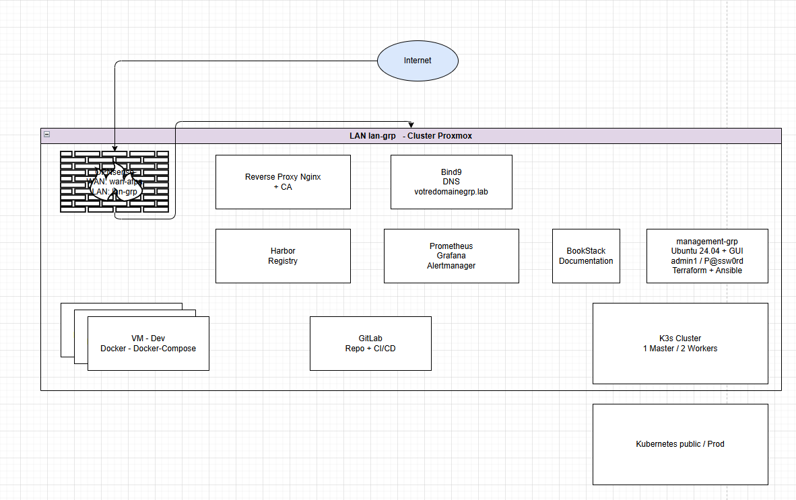

# ☁️ Infrastructure & Deployment

Ce dépôt contient le code **Infrastructure as Code (IaC)** réalisé dans le cadre d'un TP. Il permet le déploiement automatisé d'une infrastructure virtualisée sur un cluster Proxmox, destinée à héberger une usine logicielle (GitLab, Harbor), un cluster Kubernetes (k3s) et diverses applications de gestion et de supervision.

## 👥 Membres du groupe

* **Ali ASSADRI**
* **Yanis HAMIDI**

## 🎯 Objectifs

L'objectif est de mettre en œuvre une infrastructure complète et sécurisée permettant :
1. Le provisionnement automatisé de Machines Virtuelles (Terraform) sur Proxmox.
2. La configuration réseau et sécurité (OPNsense, Reverse Proxy, CA, DNS interne).
3. Le déploiement d'une usine logicielle (GitLab, Harbor).
4. La mise en place d'un cluster Kubernetes (k3s) avec stockage persistant (NFS).
5. La supervision globale de l'infrastructure (Grafana / Prometheus).

## 🛠 Stack Technique

* **Virtualisation & Réseau :** Proxmox, OPNsense
* **IaC & Configuration :** Terraform, Ansible
* **Conteneurisation & Orchestration :** Docker, Kubernetes (k3s)
* **Services et Applicatifs :** Nginx, Bind9, GitLab, Harbor, BookStack, Prometheus, Grafana

## 🏗 Architecture & Réseau

### Schéma d'Architecture Cible

Voici le schéma directeur suivi pour la conception et la mise en place de cette infrastructure :

---

### Détails Réseau

* **Réseau LAN** : `10.212.213.0/24`
* **Nom de domaine** : `grp-ay.lab`
* **Bridge Proxmox** : `vmbr_ay`

### Plan d'Adressage

| Hostname | IP | Rôle | Description |
| :--- | :--- | :--- | :--- |
| **OPNsense** | `10.212.213.1` | Pare-feu / Routeur | Passerelle du réseau LAN et sécurité. |
| **Admin** | `10.212.213.10` | Administration | Machine Debian de rebond et de pilotage de l'infrastructure. |
| **Proxy** | `10.212.213.20` | Reverse Proxy / CA | Point d'entrée unique (Nginx), Terminaison SSL, Autorité de Certification. |
| **DNS** | `10.212.213.21` | DNS (Bind9) | Résolution de noms interne pour le domaine `.lab`. |
| **GitLab** | `10.212.213.30` | CI/CD | Forge logicielle et pipelines d'intégration continue. |
| **Harbor** | `10.212.213.40` | Registre Docker | Stockage sécurisé des images conteneurs. |
| **Bookstack** | `10.212.213.41` | Documentation | Wiki pour la documentation technique de l'infrastructure. |
| **Monitoring** | `10.212.213.50` | Supervision | Serveur Grafana et Prometheus pour le suivi des métriques. |
| **k3s-manager** | `10.212.213.60` | Nœud Master | Nœud de contrôle du cluster Kubernetes (k3s). |
| **k3s-worker-1** | `10.212.213.61` | Nœud Worker | Nœud d'exécution 1 du cluster k3s. |
| **k3s-worker-2** | `10.212.213.62` | Nœud Worker | Nœud d'exécution 2 du cluster k3s. |
| **k3s-nfs** | `10.212.213.70` | Stockage (NFS) | Serveur de volumes persistants pour le cluster k3s. |
| **k3s-db** | `10.212.213.71` | Base de données | Serveur de base de données dédié au cluster k3s. |

## 📚 Documentation & Déploiement (IaC)

Le projet respecte les principes IaC : tout est versionné et automatisé. 

* **Terraform** est utilisé pour décrire l'état souhaité de l'infrastructure (VMs, Ressources) sur le cluster Proxmox.
* **Ansible** configure les machines une fois provisionnées de manière modulaire (Proxy, DNS, Docker, k3s, etc.).

**Les instructions détaillées d'installation se trouvent dans le dossier `docs/`.** Veuillez consulter les guides suivants pour déployer l'infrastructure :

1. 📖 [Prérequis et Configuration Initiale](./docs/prerequis.md)
2. 🏗️ [Déploiement de l'Infrastructure (Terraform)](./docs/Terraform.md)
3. ⚙️ [Configuration des Services (Ansible)](./docs/Ansible.md)
4. ☸️ [Gestion du Cluster Kubernetes (k3s)](./docs/creation_K3S.md)
5. 🌐 [Accès aux Applications et Endpoints](./docs/acces-services.md)

## 🔐 Sécurité & Accès

* **SSL/TLS** : Tous les services sont exposés en HTTPS via le Reverse Proxy. Une CA interne (gérée par Ansible) signe les certificats.
* **DNS** : Le serveur DNS interne permet la résolution des noms de domaine au sein du LAN, facilitant la communication entre services sans passer par les IPs.
* **Isolation** : Les services ne sont pas exposés directement, tout passe par le Reverse Proxy et le pare-feu OPNsense.

---
*Projet réalisé dans le cadre de la formation.*
