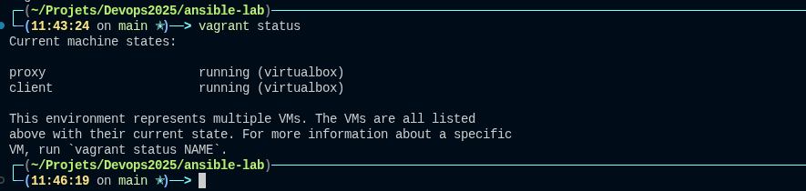
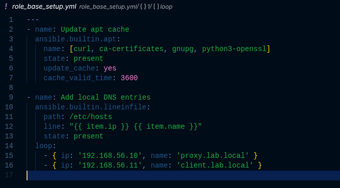
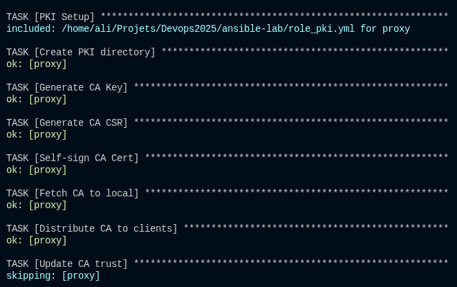
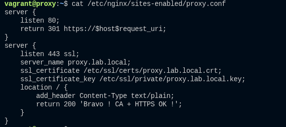
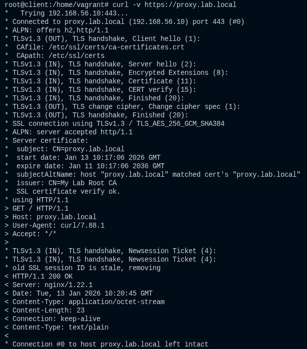

# Documentation Technique : Infrastructure PKI et Reverse Proxy Automatisée

## 1. Contexte et Objectifs

L'objectif de ce module est de mettre en place une couche de sécurité et d'accès centralisée pour l'infrastructure interne (« Home Lab »).  
Nous avons automatisé le déploiement de deux composants critiques :

- **PKI interne** (Public Key Infrastructure) : Pour sécuriser les communications (HTTPS) avec des certificats de confiance, sans dépendre d'autorités publiques.
- **Reverse Proxy (Nginx)** : Point d'entrée unique pour accéder aux services, gérant la terminaison SSL.

L'ensemble est développé en *Infrastructure as Code* (Ansible) et testé localement via Vagrant.

## 2. Architecture de Test (Vagrant)

Pour valider le code sans impacter l'infrastructure réelle (Proxmox), un environnement de développement local a été créé.

- Hyperviseur : VirtualBox  
- Orchestrateur : Vagrant  
- Machines virtuelles :  
  - `proxy` (192.168.56.10) : Serveur Nginx + Autorité de Certification  
  - `client` (192.168.56.11) : Machine utilisateur pour tester la confiance SSL

  

> Figure 1 : Démarrage de l'environnement de test avec Vagrant.

## 3. Automatisation Ansible

Le déploiement est géré par un playbook Ansible (`playbook.yml`) structuré en rôles « plats » pour simplifier la maintenance.

### 3.1. Rôle « Base Setup »

Ce module prépare le système d'exploitation de toutes les machines.

- Mise à jour du cache APT.
- Installation des outils réseaux (`curl`, `ca-certificates`).
- Gestion DNS locale : configuration automatique du fichier `/etc/hosts` pour que les machines se connaissent par leur nom de domaine (`proxy.lab.local`).



> Figure 2 : Configuration DNS automatique.

### 3.2. Rôle « PKI Interne » (Sécurité)

C'est le cœur de la sécurité du lab. Ce rôle automatise la chaîne de confiance complète :

- Génération de la CA : Création d'une autorité racine privée sur le serveur Proxy.
- Distribution : Ansible récupère le certificat public (`my_lab_ca.crt`) et le déploie sur tous les clients du réseau.
- Approbation : Mise à jour du magasin de certificats de l'OS (`update-ca-certificates`).



> Figure 3 : Déploiement de l'autorité de certification.

### 3.3. Rôle « Reverse Proxy » (Nginx)

Ce rôle transforme le serveur en portier sécurisé.

- Génération d'un certificat serveur pour `proxy.lab.local`, signé par la CA interne.
- Installation et configuration de Nginx.
- Mise en place d'un *VirtualHost* qui :
  - Redirige le HTTP (80) vers HTTPS (443).
  - Active le SSL/TLS avec le certificat généré.



> Figure 4 : Configuration Nginx avec terminaison SSL.

## 4. Validation et Tests

Une fois le provisioning Ansible terminé (`vagrant provision`), le fonctionnement est validé depuis la VM `client`.

### Test de connexion sécurisée

Utilisation de `curl` pour interroger le proxy en HTTPS :

```bash
curl -v https://proxy.lab.local
```

## Résultat attendu

- Connexion sur le port 443.  
- `SSL certificate verify ok` : preuve que le client fait confiance à la CA interne.  
- Code HTTP `200 OK`.  



> Figure 5 : Validation finale - la connexion est chiffrée et approuvée.

## 5. Conclusion

Cette brique permet désormais de déployer n'importe quel service web (GLPI, Portainer, site web) derrière le proxy en bénéficiant automatiquement :

- D'une URL propre (`service.lab.local`).  
- D'un chiffrement HTTPS valide sans avertissement de sécurité.  
- D'une configuration reproductible grâce à Ansible.

