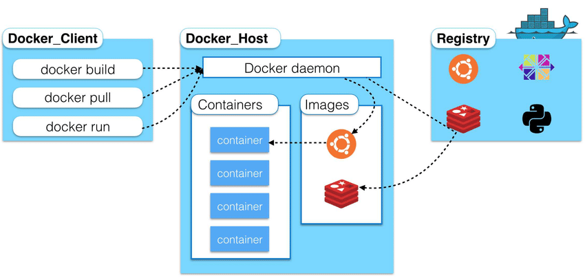
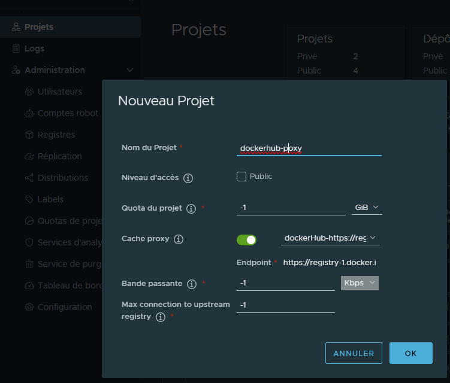
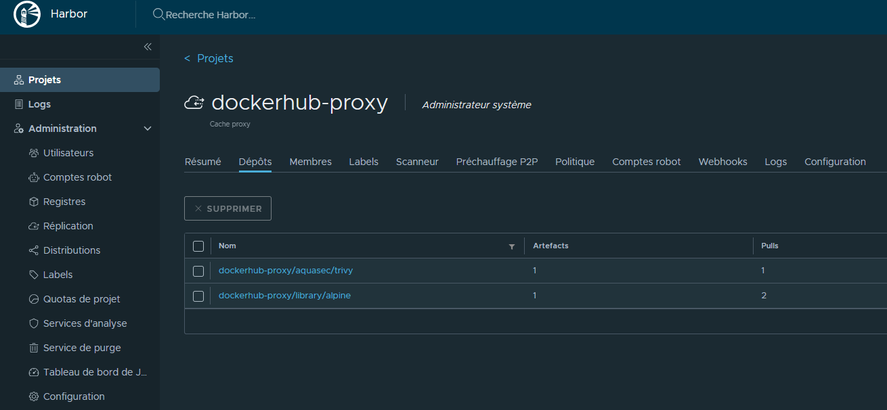
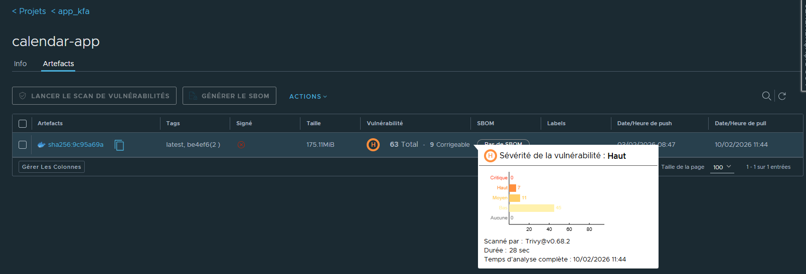
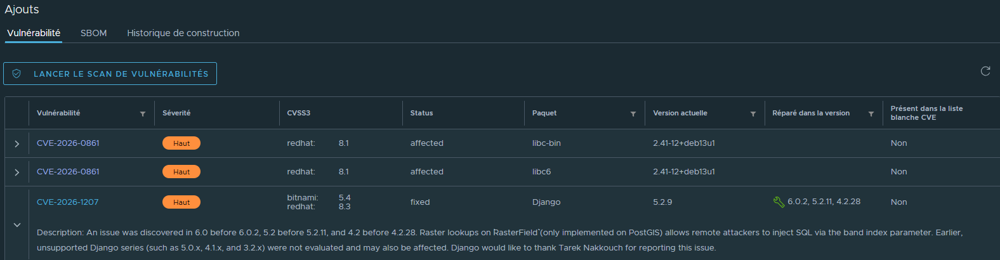
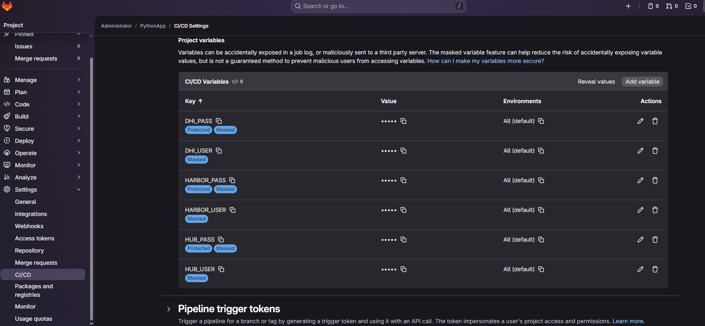
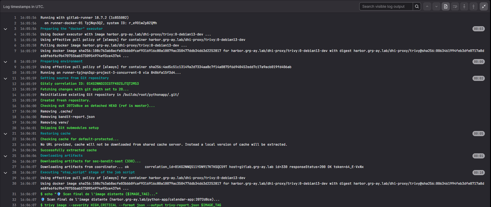

# Harbor - Proxy Cache pour Docker Hub

> **Objectif** : utiliser Harbor comme cache/mirror de Docker Hub pour accélérer les pipelines CI, réduire la dépendance à Internet et appliquer des contrôles de sécurité (scan, policies).

## Pourquoi Harbor Proxy Cache ?

- **Vitesse** : Les runners GitLab tirent les images depuis le réseau local (Harbor) au lieu de Docker Hub
- **Sécurité ("Hardening")** : Scans automatiques de vulnérabilités (CVE), policies de sécurité, robot accounts avec droits restreints
- **Indépendance** : Ne plus être bloqué par les limites Docker Hub (100–200 pulls/6h)



Schéma simplifié : le runner GitLab CI tire les images depuis Harbor, qui agit comme proxy cache vers Docker Hub.

---

## 1. Configuration Harbor : créer l'endpoint Docker Hub

Dans Harbor :

1. Aller dans **Registries** > **New Endpoint**
2. Type : **Docker Hub**
3. URL : `https://hub.docker.com` (laisser par défaut)
4. Credentials : laisser vide (accès public) ou mettre un compte Docker Hub si vous avez un compte Pro (rate-limits plus élevés)


---

## 2. Configuration Harbor : créer le projet Proxy Cache

1. **Projects** > **New Project**
2. Nom : `dockerhub-proxy` (ou `hub`)
3. Cocher la case **"Proxy Cache"**
4. Dans le menu déroulant **Registry**, sélectionner l'endpoint Docker Hub créé à l'étape 1





---

## 3. Utilisation dans GitLab CI/CD

### Avant (Direct Docker Hub)

```yaml
stages:
  - build
  - test

test_job:
  stage: test
  image: nginx:latest
  script:
    - nginx -v

```

**Après (via Harbor Proxy)**
```yaml
stages:
  - build
  - test

test_job:
  stage: test
  image: harbor.local/dockerhub-proxy/library/nginx:latest
  script:
    - nginx -v
```


### 4. Attention au préfixe `library/`

⚠️ Les images officielles Docker Hub ont un namespace implicite `library/`.

| Image Docker Hub | URL Harbor Proxy Cache |
| :--- | :--- |
| `nginx:latest` | `harbor.local/dockerhub-proxy/library/nginx:latest` |
| `python:3.9` | `harbor.local/dockerhub-proxy/library/python:3.9` |
| `redis:alpine` | `harbor.local/dockerhub-proxy/library/redis:alpine` |
| `myuser/app:v1` | `harbor.local/dockerhub-proxy/myuser/app:v1` |

## 5. Scan automatique des vulnérabilités

Activer le scan Trivy intégré :
1.  Dans le projet `dockerhub-proxy` : **Configuration** > **CVE Allowlist**
2.  Cocher **"Automatically scan images on push"**

**Résultat** : Dès que Harbor cache une image (ex: `nginx:latest`), Trivy la scanne automatiquement.





---

## 6. Créer un Robot Account dans Harbor

Pour que la CI/CD puisse tirer des images (même publiques, si votre Harbor est privé ou pour le suivi), utilisez un compte robot.

1.  Connectez-vous à Harbor avec un compte admin.
2.  Allez dans **Projects** → choisissez votre projet `dhi-proxy`.
3.  Onglet **Robot Accounts** → **New Robot Account**.
4.  Remplissez :
    * **Name** : `dhirobot`
    * **Duration** : 30 jours (ou illimité pour un service compte).
    * **Permissions** : `pull` (lecture seule) sur le projet.
5.  Cliquez sur **OK** → **Copiez le token généré** (il ne sera plus visible ensuite).

> **Conseil** : Gardez le nom court et sans caractères spéciaux.


---

## 7. Mettre les variables Harbor dans GitLab CI/CD

Dans GitLab, allez dans votre projet → **Settings** → **CI / CD** → **Variables**.
Ajoutez les variables suivantes (toutes masquées / protégées) :

| Variable | Valeur exemple | Description |
| :--- | :--- | :--- |
| `HARBOR_HOST` | `harbor.local` | Nom de domaine ou IP de votre Harbor. |
| `HARBOR_PROJECT` | `dockerhub-proxy` | Nom du projet Harbor créé à l'étape 2. |
| `HARBOR_USER` | `robot$gitlab-runner-pull` | Nom complet du robot (**Attention** : inclure le préfixe `robot$`). |
| `HARBOR_PASSWORD` | `[token généré]` | Le secret copié à l'étape précédente. |



---

## 8. Exemple de job complet qui récupère l’image

Voici un exemple de `.gitlab-ci.yml` qui s'authentifie puis utilise le proxy.

```yaml
stages:
  - test

before_script:
  # Authentification du runner auprès de Harbor
  - echo "$HARBOR_PASSWORD" | docker login "$HARBOR_HOST" -u "$HARBOR_USER" --password-stdin

test_job:
  stage: test
  # Utilisation de l'image via le Proxy Cache
  image: "$HARBOR_HOST/$HARBOR_PROJECT/library/nginx:latest"
  script:
    - nginx -v
    - echo "✅ Image tirée depuis Harbor (proxy cache Docker Hub)"
```

**Si le job passe en vert, c’est que :**
1.  Le `docker login` a réussi.
2.  Harbor a servi l’image `nginx:latest` depuis son cache local.
3.  Le runner n’a pas communiqué directement avec Docker Hub.



---

## Annexe : Configuration technique des Runners

Sur les machines qui exécutent les runners Docker et qui doivent accéder à Harbor (si le certificat est auto-signé ou si c'est du HTTP), configurez `/etc/docker/daemon.json` :

```json
{
  "insecure-registries": [
    "harbor.local",
    "harbor.local:80",
    "192.168.50.1:80"
  ]
}
```

Puis redémarrer Docker :
```bash
sudo systemctl restart docker
```

---

## Troubleshooting

* **Problème d'authentification** : Assurez-vous d'utiliser le nom complet du robot (`robot$nom`) et que le mot de passe ne contient pas de caractères échappés bizarrement par le shell.
* **Image not found** : Vérifiez que l'image existe sur Docker Hub. Si c'est la première fois, Harbor doit la télécharger, ce qui peut prendre quelques secondes.
* **DNS issues** : Si le runner ne trouve pas `harbor.local`, ajoutez l'entrée dans `/etc/hosts` du runner ou configurez votre DNS interne.