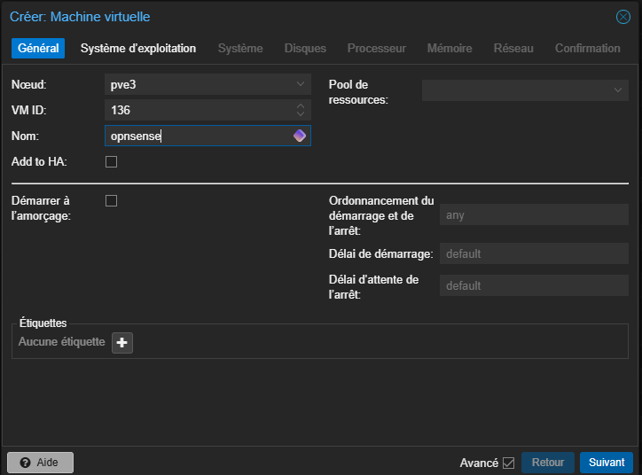
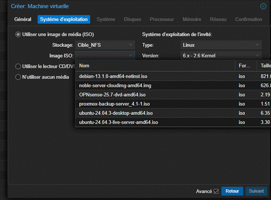
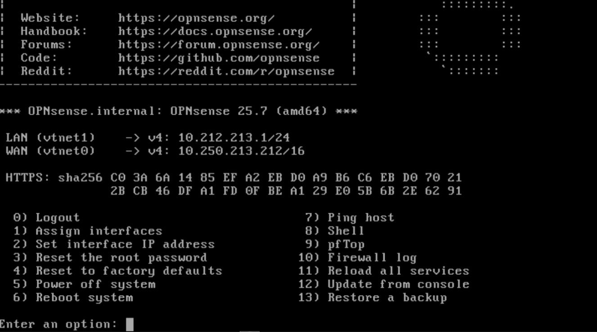
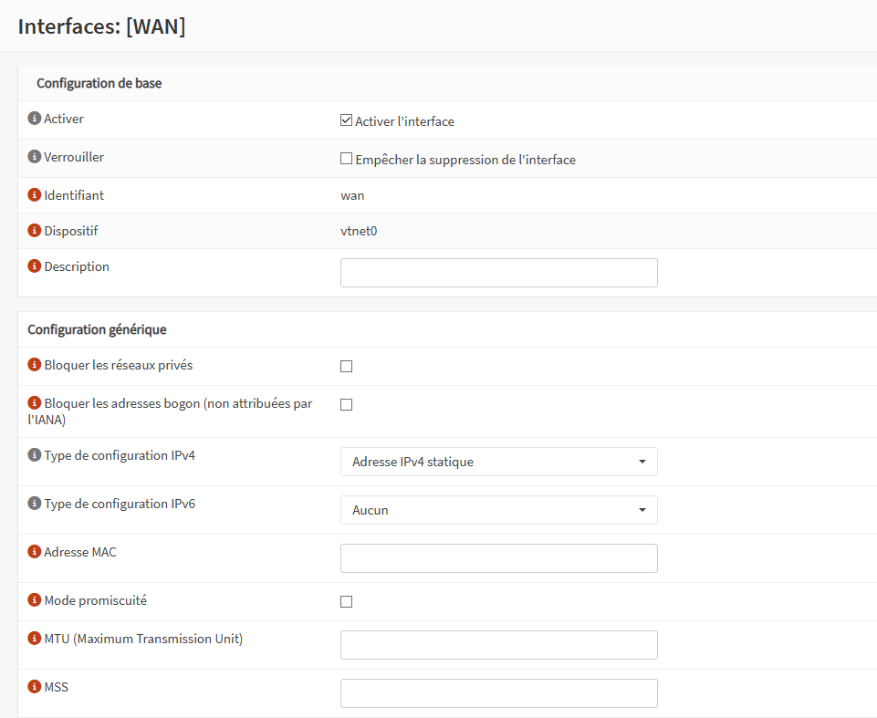
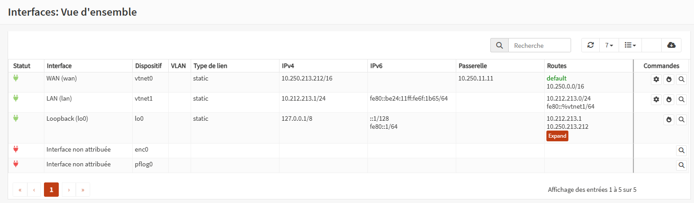
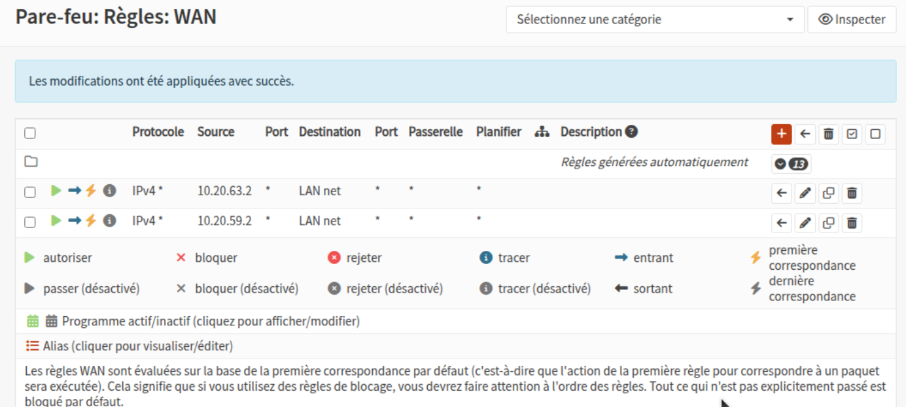
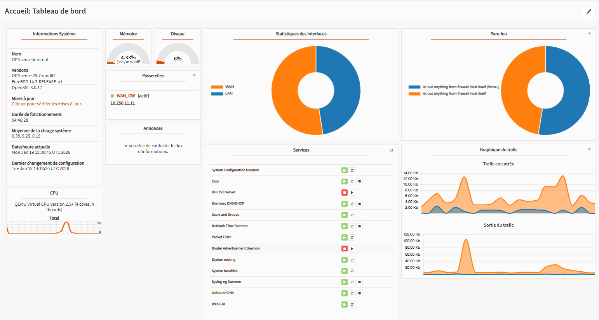

# Documentation : Installation et Configuration d’OPNsense sur Proxmox VE

## Introduction

**OPNsense** est un pare-feu open source basé sur FreeBSD, développé comme une alternative à pfSense.  
Il offre des fonctionnalités avancées telles que la détection d'intrusion (IDS), le proxy cache, le tunneling VPN, et la gestion DHCP/DNS.  

Cette documentation décrit l’installation et la configuration d’OPNsense sur une infrastructure **Proxmox VE**.

### Objectifs

- Téléverser l’ISO OPNsense sur Proxmox  
- Configurer les interfaces WAN et LAN  
- Établir les règles de pare-feu pour les deux réseaux  
- Documenter chaque étape avec emplacements pour les captures d’écran

---

## 2. Téléversement de l’ISO sur Proxmox

### 2.1 Téléchargement de l’ISO OPNsense

1. Rendez-vous sur [https://opnsense.org/download/](https://opnsense.org/download/)  
2. Sélectionnez l’architecture **AMD64 (64-bit standard)**  
3. Type d’image : **DVD** (requis pour Proxmox)  
4. Choisissez un miroir proche (France recommandé)  
5. Téléchargez le fichier ISO compressé  
6. Décompressez le fichier avec 7-Zip ou WinRAR  

---

### 2.2 Téléversement de l’ISO vers Proxmox

1. Connectez-vous à [https://10.250.250.3:8006](https://10.250.250.3:8006/)  
2. Dans le menu, sélectionnez votre nœud → **Storage > local**  
3. Onglet **ISO Images** → cliquez sur **Upload**  
4. Sélectionnez le fichier ISO OPNsense  
5. Cliquez sur **Upload** et attendez la fin du transfert  

---

## 3. Interfaces WAN et LAN

### 3.1 Architecture générale

L’infrastructure comprend :
- **WAN** : connectée à Internet  
- **LAN** : connectée aux machines locales  
Chaque interface doit être assignée à une carte réseau virtuelle distincte.

---

### 3.2 Création de la machine virtuelle OPNsense

#### Étape 1 : Créer une VM

- Cliquez sur **Create VM**  
- **VM ID** : ex. 100  
- **Name** : `OPNsense-FW`  
- **Node** : sélectionnez votre nœud  

---

#### Étape 2 : Configuration du stockage et ISO

Onglet **OS** :
- **ISO Image** : ISO OPNsense précédemment uploadée  
- **Type** : BSD  
- **Version** : par défaut  

Onglet **System** :
- **Graphic card** : VGA  
- **BIOS** : SeaBIOS  

Onglet **Disks** :
- **Disk size** : 20 Go minimum (40 Go recommandé)  
- **Discard** : activé  

---

#### Étape 3 : Ressources CPU et RAM

Onglet **CPU** :
- **Cores** : 2 minimum (4 recommandé)  
- **Type** : host  

Onglet **Memory** :
- **RAM** : 2 Go minimum (4 Go recommandé)  
- **Ballooning** : activé  

---

#### Étape 4 : Ajouter une interface LAN

1. Sélectionnez la VM → **Hardware**  
2. Cliquez sur **Add → Network Device**  
3. Choisissez un bridge (ex: vmbr1)  
4. **Model** : Intel e1000  

---

### 3.3 Assignation des interfaces dans OPNsense

1. Démarrez la VM et accédez à la console  
2. OPNsense détecte deux interfaces (em0 et em1)  
3. Assignez :
   - **WAN** : em0  
   - **LAN** : em1  

---

## 4. Configuration des interfaces et pare-feu

### 4.1 Accès à l’interface web OPNsense

- Identifiant : `installer`  
- Mot de passe : `opnsense`  
- URL : [https://192.168.1.1](https://192.168.1.1)

---

### 4.2 Configuration de l’interface WAN

#### DHCP

- **IPv4 Configuration Type** : DHCP  
- **IPv6** : None  
- Sauvegarder et **Apply Changes**

#### IP statique

- **IPv4 Configuration Type** : Static IPv4  
- **Adresse IP** : 203.0.113.10  
- **Gateway** : 203.0.113.1 

---

### 4.3 Configuration de l’interface LAN

- **IPv4 Configuration** : Static IPv4  
- **Adresse IP** : 192.168.1.1 /24  

---

## 5. Configuration des règles de pare-feu

### 5.1 Règles par défaut

- **LAN** :
  - Anti-lockout rule
  - Allow All LAN to Any  
- **WAN** :
  - Tout trafic entrant bloqué

---
### 5.2 Règles WAN

---

## 6. Tests et vérifications

### 6.1 Connectivité WAN

- Vérifiez **Interfaces > Overview** :
  - IP valide
  - Statut "Up"
  - Gateway définie

---