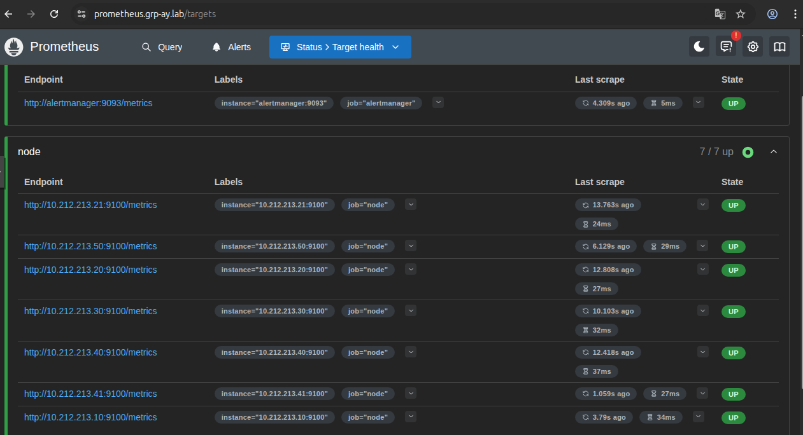
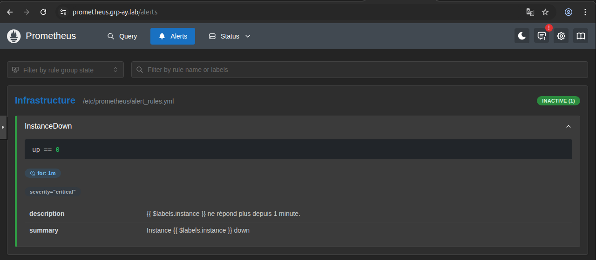

# Documentation Service Prometheus

## 1. Vue d'ensemble

**Prometheus** est le cœur du système de monitoring. C'est une base de données de séries temporelles (TSDB) qui :
1.  **Collecte (Scrape) :** Va chercher les métriques sur les agents (Node Exporter) toutes les 15 secondes.
2.  **Stocke :** Garde l'historique des données (CPU, RAM, Disque).
3.  **Alerte :** Évalue des règles (ex: "Si CPU > 90%") et envoie des notifications à Alertmanager.

### Emplacement
* **Serveur :** VM Monitoring (`10.212.213.50`).
* **Port interne :** `9090`.
* **URL publique :** `https://prometheus.grp-ay.lab` (via Proxy Nginx).

---

## 2. Configuration Ansible (`roles/monitoring`)

Prometheus est déployé via Docker avec trois volumes principaux pour la persistance et la configuration.

**Extrait du `docker-compose` (Ansible) :**
```yaml
image: prom/prometheus:latest
volumes:
  - prometheus_data:/prometheus                       # Stockage des données
  - /opt/monitoring/prometheus/prometheus.yml:/etc/prometheus/prometheus.yml # Config principale
  - /opt/monitoring/prometheus/alert_rules.yml:/etc/prometheus/alert_rules.yml # Règles d'alertes
command:
  - '--config.file=/etc/prometheus/prometheus.yml'
  - '--storage.tsdb.retention.time=15d' # Rétention de 15 jours
```

---

## 3. Configuration du Scraping (`prometheus.yml`)

C'est le fichier qui dit à Prometheus **qui** surveiller. Il est généré dynamiquement par Ansible grâce à une boucle Jinja2 sur l'inventaire.

**Fichier :** `/opt/monitoring/prometheus/prometheus.yml`

```yaml
global:
  scrape_interval: 15s # Fréquence de collecte

# Liaison avec Alertmanager
alerting:
  alertmanagers:
    - static_configs:
        - targets: ['alertmanager:9093']
rule_files:
  - "alert_rules.yml"

scrape_configs:
  # 1. S'auto-surveiller
  - job_name: 'prometheus'
    static_configs:
      - targets: ['localhost:9090']

  # 2. Surveiller Alertmanager
  - job_name: 'alertmanager'
    static_configs:
      - targets: ['alertmanager:9093']

  # 3. Surveiller l'Infrastructure (Node Exporter)
  # Le nom 'node' est CRITIQUE pour les dashboards Grafana
  - job_name: 'node'
    static_configs:
      - targets:
        # Liste générée automatiquement par Ansible :
        - '10.212.213.20:9100'
        - '10.212.213.30:9100'
        - '10.212.213.50:9100'
```

---

## 4. Règles d'Alertes (`alert_rules.yml`)

Prometheus évalue ces règles en permanence. Si une condition est vraie, l'alerte passe en état "Pending" puis "Firing".

**Exemple de règle "Instance Down" :**

```yaml
groups:
  - name: Infrastructure
    rules:
      - alert: InstanceDown
        # Condition : Si la métrique 'up' vaut 0 (machine injoignable)
        expr: up == 0
        # Durée avant déclenchement : 1 minute
        for: 1m
        labels:
          severity: critical
        annotations:
          summary: "Instance {{ $labels.instance }} down"
          description: "{{ $labels.instance }} ne répond plus depuis 1 minute."
```

---

## 5. Vérification et Utilisation

### A. Vérifier les Cibles (Targets)
Pour s'assurer que Prometheus arrive bien à parler à tous les Node Exporters.

1.  Accéder à **`https://prometheus.grp-ay.lab`**.
2.  Menu **Status > Targets**.
3.  Vérifier la section `node`.
4.  **État attendu :** Tous les endpoints doivent être **UP** (Vert).




### B. Vérifier les Alertes
1.  Menu **Alerts**.
2.  Vous devez voir la règle `InstanceDown` en vert (Inactive) si tout va bien.
3.  Pour tester : Arrêtez `node_exporter` sur une VM (`docker stop node_exporter`).
4.  L'alerte passera en rouge (**Firing**) après 1 minute.


---

## 6. Dépannage Rapide

* **Target DOWN avec erreur "Connection refused" :** Le Node Exporter est éteint sur la VM cible.
