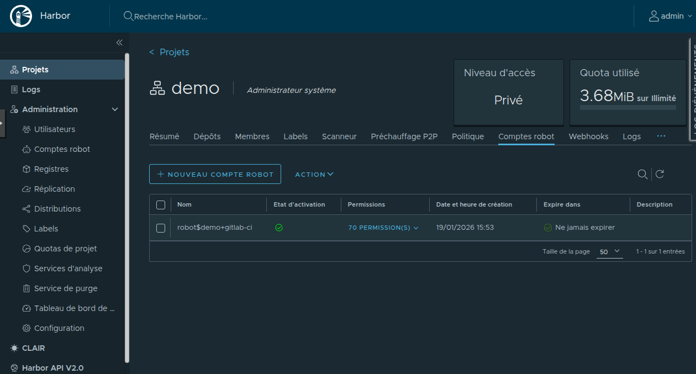
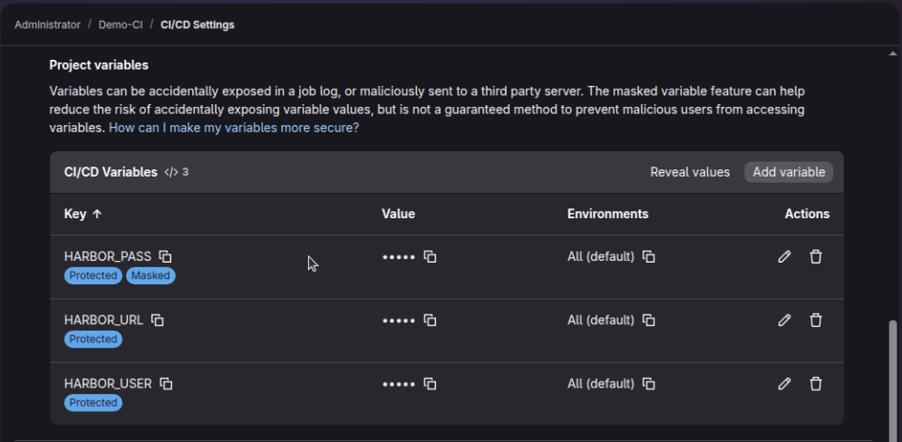
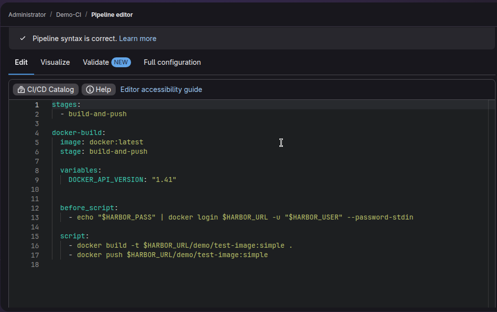
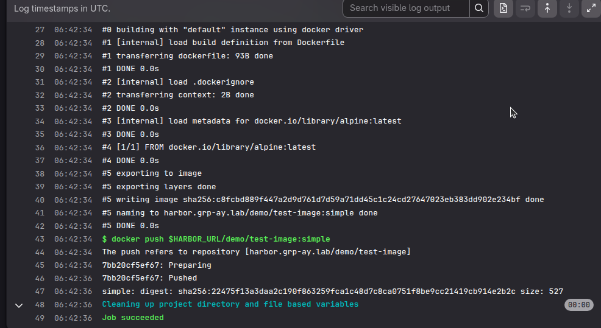
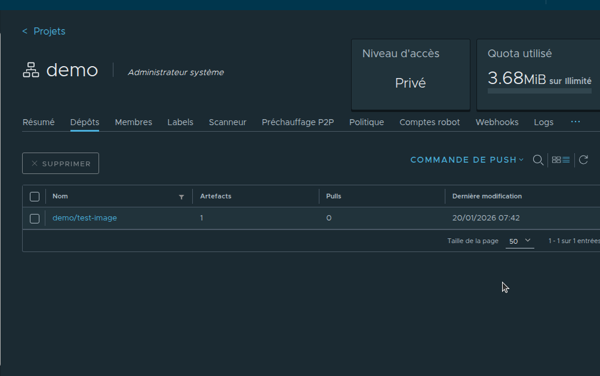

# Documentation CI/CD : Pipeline Docker (GitLab vers Harbor)

## 1. Vue d'ensemble

L'objectif de ce pipeline est d'automatiser la création et le stockage des conteneurs Docker.
Le Runner GitLab utilise le moteur Docker de la machine hôte (via le socket `/var/run/docker.sock`) pour construire l'image et l'envoyer vers Harbor.

---

## 2. Prérequis sur Harbor

1.  **Projet :** Un projet nommé `demo` a été créé.
2.  **Compte Robot :** Un compte robot a été généré pour l'authentification CI/CD.

---

## 3. Configuration des Variables (GitLab)

Dans **Settings > CI/CD > Variables**, nous avons défini :

| Clé (Key) | Valeur (Exemple) | Note |
| :--- | :--- | :--- |
| `HARBOR_URL` | `https://harbor.grp-ay.lab` | L'URL complète avec le protocole. |
| `HARBOR_USER` | `robot$gitlab-ci` | Nom du compte robot. |
| `HARBOR_PASS` | `e2d...` (Secret) | Mot de passe masqué. |

## 4. Le Pipeline (`.gitlab-ci.yml`)

---

## 5. Exécution et Validation

### Côté GitLab
Le job doit afficher **"Job Succeeded"**.
Dans les logs, on vérifie :
1.  `Login Succeeded`
2.  Le téléchargement des layers.
3.  Le message final de réussite.

### Côté Harbor
Dans le projet `demo`, le dépôt `test-image` doit apparaître avec le tag `simple`.

>
---

## 6. Problème résolu (Troubleshooting)

### Erreur : `invalid reference format`
* **Symptôme :** Le pipeline échouait lors de la commande `docker build`.
* **Cause :** Nous utilisions `$HARBOR_URL` (qui contient `https://`) pour nommer l'image. Docker interdit le protocole dans le nom du tag.
* **Solution :** Création de la variable locale `HARBOR_DOMAIN: "harbor.grp-ay.lab"` dans le YAML pour taguer l'image correctement, tout en gardant `HARBOR_URL` pour d'autres usages si besoin.