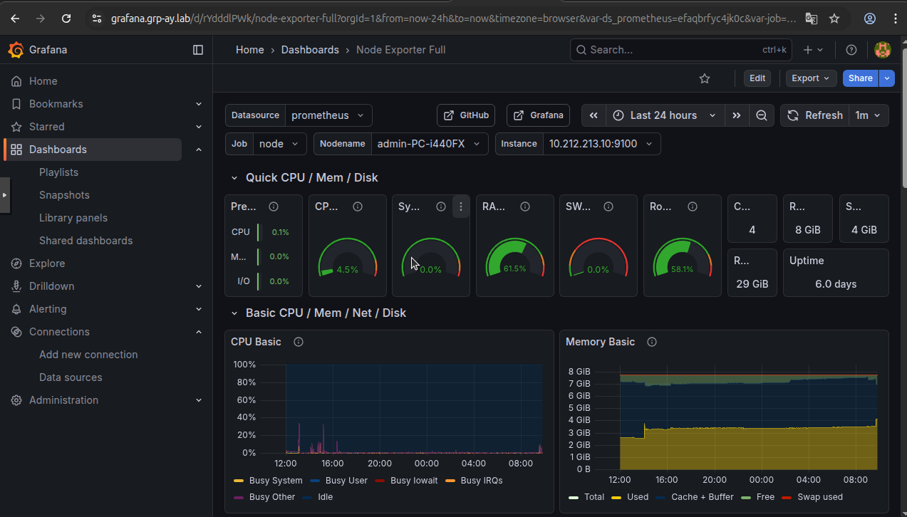

# Documentation Service Grafana

## 1. Vue d'ensemble

**Grafana** est la plateforme de visualisation. Elle ne stocke pas de données elle-même, mais interroge **Prometheus** pour afficher des graphiques (CPU, RAM, Disque) et **Alertmanager** pour afficher l'état des alertes.

### Accès
* **URL Publique :** `https://grafana.grp-ay.lab` (via le Proxy Nginx sur la .20).
* **Serveur Réel :** VM Monitoring (`10.212.213.50`).
* **Port Interne :** `3000`.
* **Identifiants par défaut :** `admin` / `admin`.

---

## 2. Configuration Ansible (`roles/monitoring`)

Grafana est déployé dans un conteneur Docker avec un système de **Provisioning** (Configuration-as-Code). Cela permet de pré-configurer les sources de données et les dashboards sans action manuelle.

**Volumes Docker configurés :**
1.  **Données persistantes :** `grafana_data:/var/lib/grafana` (Stocke les utilisateurs, sessions, préférences).
2.  **Configuration Datasources :** `datasources.yml` monté dans `/etc/grafana/provisioning/datasources/`.
3.  **Configuration Dashboards :** `dashboards.yml` monté dans `/etc/grafana/provisioning/dashboards/`.
4.  **Fichiers JSON :** Les dessins des graphiques sont montés directement (ex: `node_exporter_full.json`).

---

## 3. Configuration des Sources de Données (Automatisée)

Les connexions aux bases de données sont définies dans le fichier `roles/monitoring/files/grafana/datasources/datasources.yml`.

Grafana utilise le **réseau interne Docker** pour communiquer avec ses voisins.

### A. Source Prometheus
* **Type :** `prometheus`
* **URL :** `http://prometheus:9090`
* **Note :** On utilise le nom du conteneur, pas l'URL publique `https`.

### B. Source Alertmanager
* **Type :** `alertmanager`
* **URL :** `http://alertmanager:9093`
* **Implementation :** Prometheus.

---

## 4. Tableaux de Bord (Automatisés)

Le dashboard standard **Node Exporter Full (ID 1860)** est importé automatiquement au démarrage grâce au provider défini dans `dashboards.yml`.

### Fonctionnement
1.  Ansible copie le fichier `node_exporter_full.json` sur la VM `.50`.
2.  Grafana démarre, lit `dashboards.yml`.
3.  Il charge le JSON et l'affiche sous le nom "Node Exporter Full".

### Filtres par défaut
Le dashboard est configuré pour utiliser la source `Prometheus` et le job `node` (défini dans la configuration Prometheus).

---

## 5. Visualisation des Alertes

Pour voir les alertes (ex: "InstanceDown") directement dans le dashboard, un panneau spécifique est ajouté.

**Configuration du Panneau "Alert List" :**
* **Visualisation :** Alert List.
* **Show :** `Alertmanager` (Indispensable pour voir les alertes externes).
* **Data source :** `Alertmanager`.

---
